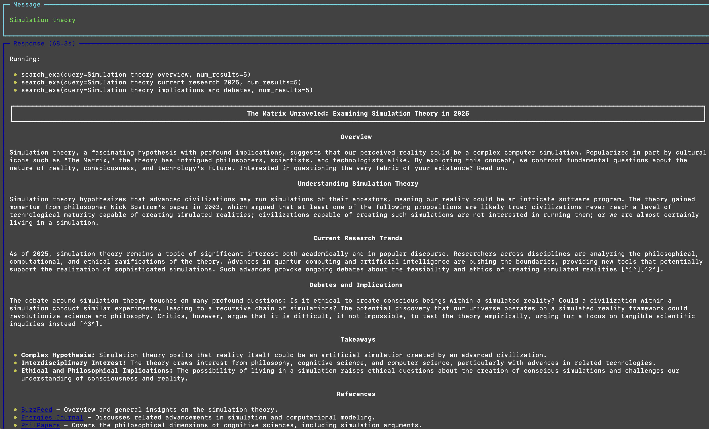
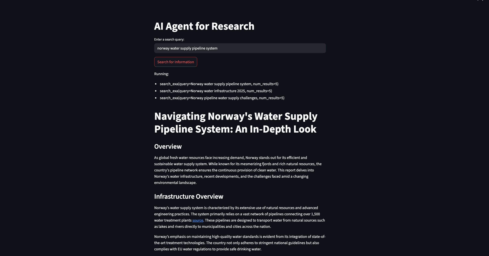

# 🔬 AI Research Agent

> **Professional research reports powered by GPT-4 and advanced web search technology**

[](https://python.org)
[](https://streamlit.io)
[](https://openai.com)
[](https://exa.ai)
[](https://opensource.org/licenses/MIT)

## 🚀 What is this?

An **intelligent research assistant** that automatically generates comprehensive, well-structured research reports on any topic. Using **GPT-4's advanced reasoning** combined with **Exa's powerful search capabilities**, this agent conducts multi-faceted research and produces **publication-quality reports** with proper citations and references.

## ✨ Features

- 🧠 **Advanced AI Research**: GPT-4 powered intelligent analysis and synthesis
- 🔍 **Multi-Search Strategy**: Conducts 3 different targeted searches per topic
- 📰 **NYT-Quality Reports**: Professional, engaging, and well-structured content
- 📅 **Current Information**: Searches for the latest publications and developments
- 📚 **Proper Citations**: Includes credible sources and references
- 💾 **Auto-Save Reports**: Automatically saves reports as markdown files
- 🎨 **Interactive Interface**: Beautiful Streamlit web application
- 📊 **Structured Output**: Consistent, professional report formatting
- ⏰ **Real-time Research**: Uses current date for recent information retrieval

## 🎯 Use Cases

- **Academic Research**: Generate literature reviews and research summaries
- **Market Analysis**: In-depth industry and trend reports
- **Technology Assessment**: Analysis of emerging technologies and innovations
- **Policy Research**: Comprehensive policy analysis and recommendations
- **Content Creation**: Well-researched articles and blog posts
- **Due Diligence**: Company and investment research reports
- **Educational Content**: Study materials and educational resources
- **Journalism**: Background research for news articles and features

## 🛠️ Installation

1. **Clone the repository**
   ```bash
   git clone <repository-url>
   cd "Research Agent"
   ```

2. **Install dependencies**
   ```bash
   pip install phi-ai streamlit openai python-dotenv exa-py
   ```

3. **Set up environment variables**
   Create a `.env` file in the project root:
   ```env
   OPENAI_API_KEY=your_openai_api_key_here
   EXA_API_KEY=your_exa_api_key_here
   ```

4. **Get your Exa API Key**
   - Visit [Exa.ai](https://exa.ai) to sign up for an API key
   - Exa provides advanced search capabilities beyond traditional search engines

## 🚀 Quick Start

### Option 1: Command Line Interface
```bash
python research_agent.py
```

### Option 2: Interactive Web Interface
```bash
streamlit run streamlit_research_agent.py
```

## 📝 Example Usage

```python
from phi.agent import Agent
from phi.model.openai import OpenAIChat
from phi.tools.exa import ExaTools
from datetime import datetime

# Create the research agent
agent = Agent(
    model=OpenAIChat(id="gpt-4o"),
    tools=[ExaTools(
        start_published_date=datetime.now().strftime("%Y-%m-%d"), 
        type="keyword"
    )],
    description="You are an advanced AI researcher writing a report on a topic.",
    instructions=[
        "For the provided topic, run 3 different searches.",
        "Read the results carefully and prepare a NYT worthy report.",
        "Focus on facts and make sure to provide references.",
    ],
    save_response_to_file="tmp/{message}.md"
)

# Generate a research report
response = agent.run("Artificial Intelligence in Healthcare")
```

## 📋 Report Structure

Each generated report follows a professional structure:

```markdown
## Engaging Report Title

### Overview
- Brief introduction and hook for readers
- Why this topic matters

### Section 1, 2, 3...
- Detailed analysis broken into logical sections
- Facts, processes, and key information
- Current developments and trends

### Takeaways
- Key insights and conclusions
- Important points to remember

### References
- Credible sources with links
- Publication date
```

## 📸 Screenshots


*Clean and intuitive Streamlit interface for research queries*


*Professional research report with proper structure and citations*

## 🏗️ Research Process

```
🔬 Research Workflow
├── 📝 Query Analysis
│   ├── Topic understanding
│   ├── Research scope definition
│   └── Search strategy planning
├── 🔍 Multi-Search Execution
│   ├── Search 1: General overview
│   ├── Search 2: Current developments
│   └── Search 3: Specific insights
├── 📊 Data Synthesis
│   ├── Information analysis
│   ├── Fact verification
│   └── Content structuring
└── 📰 Report Generation
    ├── Professional formatting
    ├── Citation management
    └── Quality assurance
```

## 📁 Project Structure

```
📦 Research Agent/
├── 🔬 research_agent.py              # Command-line research tool
├── 🎨 streamlit_research_agent.py    # Interactive web interface
├── 📁 tmp/                          # Generated research reports
│   ├── 🧠 Simulation theory.md
│   └── 💧 norway water supply pipeline system.md
├── 🖼️ Output-1.png                   # Interface screenshot
├── 🖼️ Output-2.png                   # Report example
└── 📖 README.md                      # This file
```

## 🎛️ Advanced Configuration

### Custom Search Parameters
```python
# Configure search timeframe and type
tools=[ExaTools(
    start_published_date="2024-01-01",  # Custom date range
    end_published_date="2025-12-31",
    type="keyword",                     # or "neural"
    num_results=10                      # Results per search
)]
```

### Custom Report Templates
```python
# Modify expected output format
expected_output=dedent("""\
    ## {Custom Title Structure}
    
    ### Executive Summary
    {Your custom sections}
    
    ### Methodology
    {Research approach}
    
    ### Findings
    {Key discoveries}
    
    ### Recommendations
    {Action items}
""")
```

## 📊 Sample Research Topics

- **Technology**: "Quantum Computing Applications in 2025"
- **Science**: "Climate Change Mitigation Strategies"
- **Business**: "Remote Work Impact on Productivity"
- **Healthcare**: "Personalized Medicine Advances"
- **Education**: "AI in Educational Technology"
- **Finance**: "Cryptocurrency Market Trends"
- **Social Issues**: "Digital Privacy and Data Protection"

## 🔧 Customization Options

- **Search Engines**: Switch between different search providers
- **Report Formats**: Customize output templates and styling
- **Save Locations**: Configure where reports are saved
- **Citation Styles**: Modify reference formatting
- **Content Depth**: Adjust research thoroughness level

## 🤝 Contributing

Enhance the research capabilities:
- 📚 Additional search engine integrations
- 📊 Data visualization features
- 🔄 Automated fact-checking
- 📱 Mobile-responsive interface
- 🤖 Multiple AI model support
- 📈 Analytics and reporting metrics

## 📄 License

This project is open source and available under the [MIT License](LICENSE).

## 🙏 Acknowledgments

- [Phi Framework](https://github.com/phidatahq/phidata) - Powerful AI agent framework
- [OpenAI](https://openai.com) - GPT-4 language model
- [Exa](https://exa.ai) - Advanced search technology
- [Streamlit](https://streamlit.io) - Interactive web applications

---

⭐ **Star this repository if you found it helpful!**

🔬 **Ready to revolutionize your research process?** Start generating professional reports now!